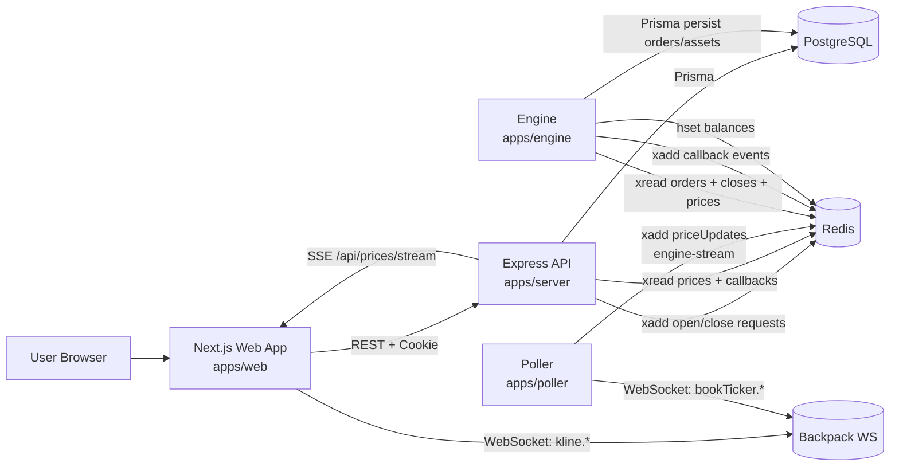
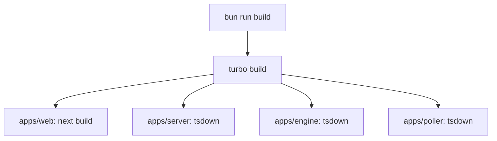
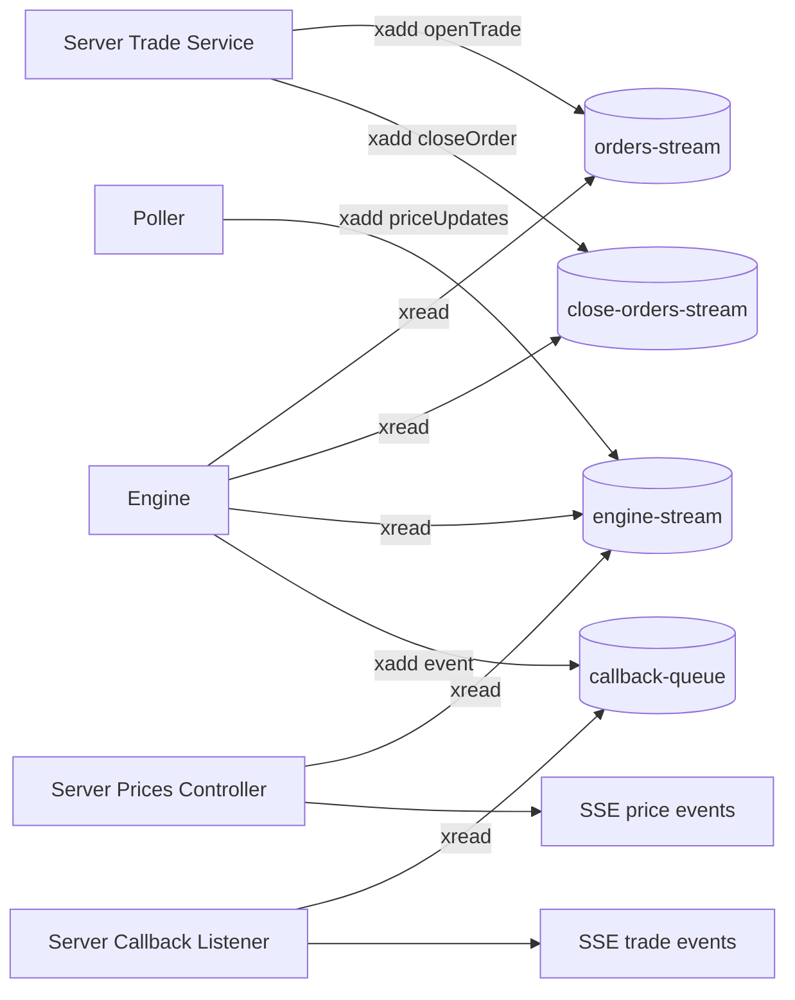
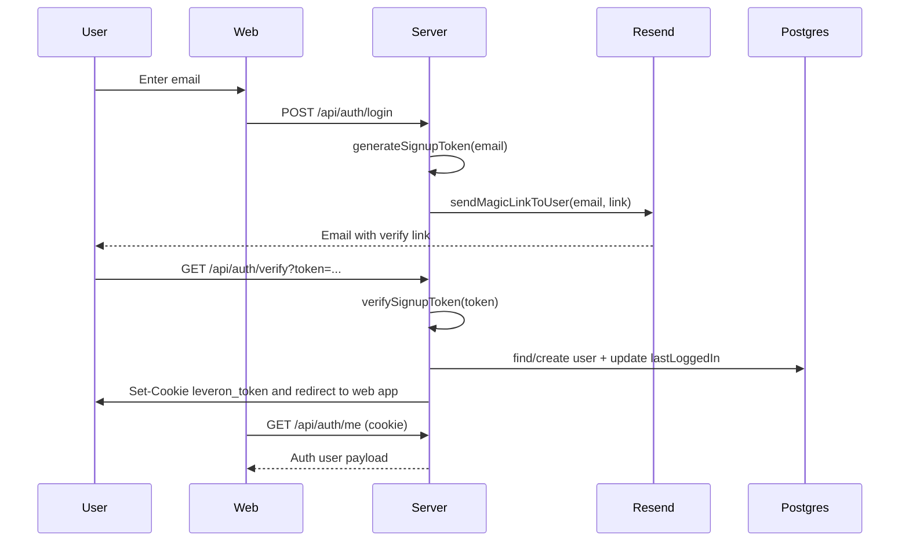
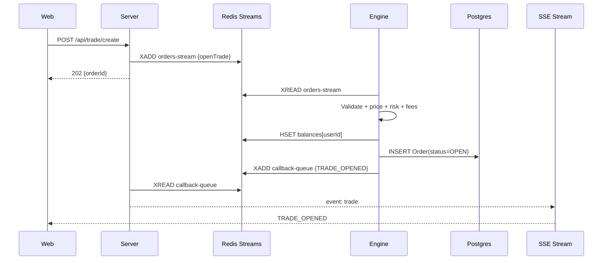
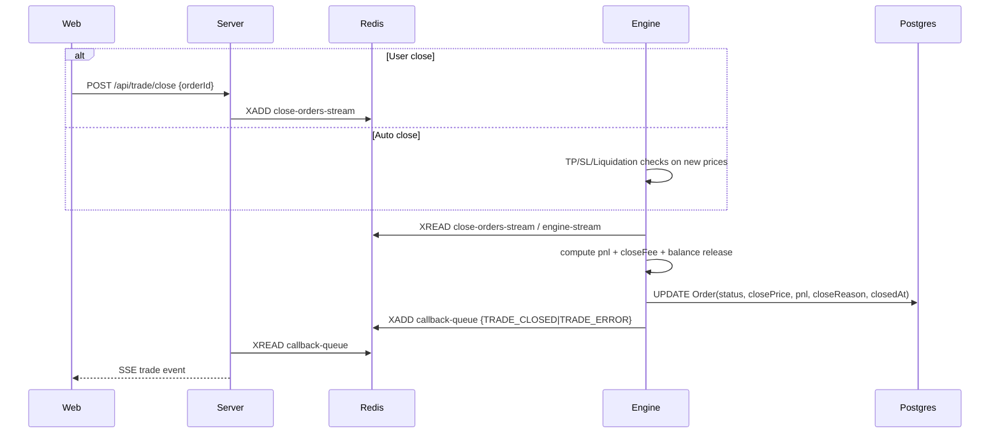
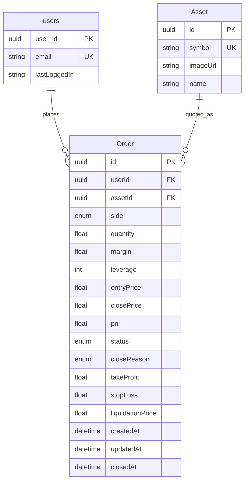

# Leveron

Leveron is a full-stack, event-driven perpetual trading simulator built in a Bun + TypeScript monorepo.

It includes:
- A Next.js trading UI (`apps/web`)
- An Express API server (`apps/server`)
- A market-data poller (`apps/poller`)
- A trading/risk engine (`apps/engine`)
- Shared database and Redis packages (`packages/db`, `packages/redis`)

The core design is asynchronous: trade intents are queued through Redis Streams, then executed by the engine, with realtime updates pushed back to clients over SSE.

### Demo

<a href="https://youtu.be/enYH6XfkDpQ" target="_blank">
  
</a>

## What Is Built

### Product capabilities
- Magic-link authentication (email + JWT cookie session)
- Live mark prices for `BTC`, `ETH`, `SOL`
- Place leveraged `LONG` / `SHORT` orders
- Close orders manually
- Automatic close via:
  - take-profit
  - stop-loss
  - liquidation
- Realtime UI updates for:
  - prices
  - trade lifecycle events
  - balances
  - open positions and order history

### Architecture style
- Event-driven backend using Redis Streams
- Separate services for ingestion, API, and execution
- Postgres persistence for users/orders/assets
- Redis as both:
  - low-latency state store (balances)
  - message bus (streams)

## High-Level Architecture



## Monorepo Layout

```text
leveron/
├── apps/
│   ├── web/            # Next.js 16 frontend
│   ├── server/         # Express 5 API + SSE + auth + queue producer
│   ├── poller/         # Backpack WS consumer -> Redis price stream
│   └── engine/         # Trade execution + risk + persistence + callbacks
├── packages/
│   ├── db/             # Prisma client, schema, migrations, seed
│   ├── redis/          # Shared ioredis client factory
│   └── config/         # Shared TS base config
├── docker-compose.yml  # Postgres + Redis local infra
└── turbo.json          # Task orchestration
```

## How It Is Built

### Toolchain
- Runtime/package manager: `bun@1.3.0`
- Monorepo orchestration: Turborepo
- Frontend build: Next.js build pipeline
- Service/app builds: `tsdown` (server/engine/poller)
- ORM: Prisma (`@prisma/client` + `@prisma/adapter-pg`)

### Build graph



### Runtime graph in dev
`bun run dev` uses Turborepo persistent `dev` tasks and starts the apps that declare a `dev` script:
- `apps/web` on `:3000`
- `apps/server` on `:8080` (default)
- `apps/poller` worker
- `apps/engine` worker

## Redis Stream Topology



## Detailed Implementation Walkthrough

### 1) Authentication (Magic Link + Cookie Session)

Relevant files:
- `apps/server/src/controller/auth.controller.ts`
- `apps/server/src/routes/auth.routes.ts`
- `apps/server/src/middleware/auth.middleware.ts`
- `apps/server/src/utils/jwt.ts`
- `apps/server/src/utils/cookie.ts`
- `apps/server/src/utils/resendmail.ts`

Flow:
1. Client posts email to `POST /api/auth/login`.
2. Server creates a 15-minute signup token using `JWT_SECRET`.
3. Server emails a magic link via Resend to `${MAGIC_LINK_BASE_URL}/verify?token=...`.
4. User opens link -> `GET /api/auth/verify`.
5. Server verifies token, upserts user, updates `lastLoggedIn`.
6. Server sets `leveron_token` cookie (HTTP-only, `sameSite: strict`, 7-day JWT).
7. Server redirects to `http://localhost:3000`.



### 2) Price Ingestion and Distribution

#### Poller (`apps/poller`)
- Connects to `wss://ws.backpack.exchange/`
- Subscribes to:
  - `bookTicker.BTC_USDC`
  - `bookTicker.ETH_USDC`
  - `bookTicker.SOL_USDC`
- Normalizes symbols to assets (`BTC`, `ETH`, `SOL`)
- Every 1 second, publishes `priceUpdates` into Redis stream `engine-stream`

#### Server SSE (`apps/server/src/controller/prices.controller.ts`)
- `GET /api/prices/stream` (auth required)
- Opens SSE stream and emits:
  - `connected`
  - `price` (from `engine-stream`)
  - `trade` (from callback listener)
  - `error`
- Sends keepalive comment every 15s

#### UI (`apps/web/src/hooks/use-prices.ts`)
- Subscribes with `EventSource` to `/api/prices/stream`
- Maintains local `pricesByAsset`
- On trade events, invalidates balance/open/history queries
- If SSE disconnects, falls back to periodic query invalidation

### 3) Trade Open Lifecycle

Relevant files:
- `apps/web/src/components/trading/order-form.tsx`
- `apps/server/src/controller/trade.controller.ts`
- `apps/server/src/services/trades.service.ts`
- `apps/engine/index.ts`

Flow:
1. User submits create order form.
2. Server validates payload with Zod and returns `202 Accepted` with `orderId` after queueing.
3. Engine consumes `orders-stream` and executes:
   - reads current mark price
   - validates leverage/position size
   - computes entry/qty/liquidation/fees
   - adjusts Redis balance (`available`, `locked`, `total`)
   - persists order in Postgres
   - emits callback event `TRADE_OPENED` (or `TRADE_ERROR`)
4. Server callback listener forwards event to SSE clients.
5. UI refreshes open positions/history/balance.



### 4) Trade Close Lifecycle (Manual + Auto)

Close triggers:
- Manual: `POST /api/trade/close` -> queued to `close-orders-stream`
- Automatic inside engine price loop:
  - take-profit
  - stop-loss
  - liquidation checks

Engine close actions:
- Loads open order (in-memory or DB rehydrate)
- Computes PnL and close fee
- Unlocks margin, applies realized PnL to balance
- Updates DB order status (`CLOSED`/`LIQUIDATED`) + `closeReason`
- Publishes callback event (`TRADE_CLOSED` or `TRADE_ERROR`)



## Risk, Margin, and Fee Model (Current Implementation)

Asset config (`apps/engine/index.ts`):
- BTC: max leverage 100, fee rate 0.0005
- ETH: max leverage 50, fee rate 0.0005
- SOL: max leverage 20, fee rate 0.0007

Key formulas:
- Entry price:
  - LONG: `mark * (1 + slippage/100)`
  - SHORT: `mark * (1 - slippage/100)`
- Quantity: `(margin * leverage) / entryPrice`
- Liquidation price:
  - LONG: `entry * (1 - 1/leverage)`
  - SHORT: `entry * (1 + 1/leverage)`
- Fee per side: `(quantity * price) * takerFeeRate`

Risk controls:
- Position notional limit: `margin * leverage <= balance.total * 0.1`
- Liquidation checks run after each price batch
- Balance defaults to `$5000` if user has no Redis balance record

## Database Model

Relevant files:
- `packages/db/prisma/schema/schema.prisma`
- `packages/db/prisma/migrations/*`



## API Surface

Base URL in local dev: `http://localhost:8080`

### Auth
- `POST /api/auth/login` (public): send magic link email
- `GET /api/auth/verify?token=...` (public): verify link, set auth cookie, redirect
- `GET /api/auth/me` (auth): current user
- `POST /api/auth/logout` (auth): clear auth cookie

### Trading
- `POST /api/trade/create` (auth): enqueue new order request
- `POST /api/trade/close` (auth): enqueue close request
- `GET /api/trade/orders?status=OPEN|CLOSED|LIQUIDATED` (auth)
- `GET /api/trade/orders/:orderId` (auth)

### Prices / Realtime
- `GET /api/prices/klines` (public proxy to Backpack REST)
  - required params: `symbol`, `interval`, `startTime`, `endTime`
  - supported intervals: `1m`, `5m`, `15m`
- `GET /api/prices/stream` (auth SSE)

### Balance
- `GET /api/balance` (auth)

## Frontend Implementation Notes

Relevant files:
- `apps/web/src/app/page.tsx`
- `apps/web/src/components/trading/*`
- `apps/web/src/hooks/use-*.ts`
- `apps/web/src/lib/api.ts`

Behavior highlights:
- Route protection via `AuthGuard`
- API calls use `credentials: include` for cookie auth
- React Query manages cache/mutation lifecycle
- Optimistic close behavior in `useCloseTrade`
- Realtime stream drives toast notifications and query invalidation
- Candlestick chart:
  - bootstrap candles from `/api/prices/klines`
  - live kline updates directly via Backpack browser WebSocket

## Environment Variables

Copy `.env.example` to `.env` in repo root.

| Variable | Required | Purpose |
|---|---|---|
| `NODE_ENV` | yes | Runtime mode |
| `LOG_LEVEL` | no | Logger threshold (`debug/info/warn/error`) |
| `PORT` | yes | API server port (default `8080`) |
| `CORS_ORIGIN` | yes | Allowed web origin |
| `MAGIC_LINK_BASE_URL` | yes | Base URL for verify links |
| `JWT_SECRET` | yes | JWT signing secret |
| `RESEND_API_KEY` | yes for email auth | Resend API key |
| `DATABASE_URL` | yes | Postgres connection string |
| `REDIS_HOST` | yes | Redis host |
| `REDIS_PORT` | yes | Redis port |
| `NEXT_PUBLIC_SERVER_URL` | yes | Frontend server base URL fallback |
| `NEXT_PUBLIC_API_BASE_URL` | yes | Frontend API base URL |

## Local Setup

### 1. Install dependencies
```bash
bun install
```

### 2. Start Postgres + Redis
```bash
docker compose up -d
```

### 3. Configure environment
```bash
cp .env.example .env
```

### 4. Generate Prisma client and sync schema
```bash
bun run db:generate
bun run db:push
```

### 5. Seed assets
```bash
bun run db:seed
```

### 6. Start all services
```bash
bun run dev
```

Endpoints:
- Web: `http://localhost:3000`
- API: `http://localhost:8080`

## Common Commands

- `bun run dev` - start all dev services via Turbo
- `bun run build` - build all packages/apps
- `bun run check-types` - run type-check tasks
- `bun run dev:web` - start only web app
- `bun run dev:server` - start only API server
- `bun run db:generate` - generate Prisma client
- `bun run db:push` - push schema to DB
- `bun run db:migrate` - create/apply migration in dev
- `bun run db:studio` - open Prisma Studio
- `bun run db:seed` - seed assets table

## Operational Notes / Current Constraints

- Supported assets are hard-coded to `BTC`, `ETH`, `SOL`.
- Balance state is stored in Redis (with defaults), not normalized in Postgres.
- Trade create/close endpoints are async and return `202 Accepted` after enqueue.
- SSE stream is auth-protected and includes both price and trade lifecycle events.
- Auth verify redirect is currently hardcoded to `http://localhost:3000`.
